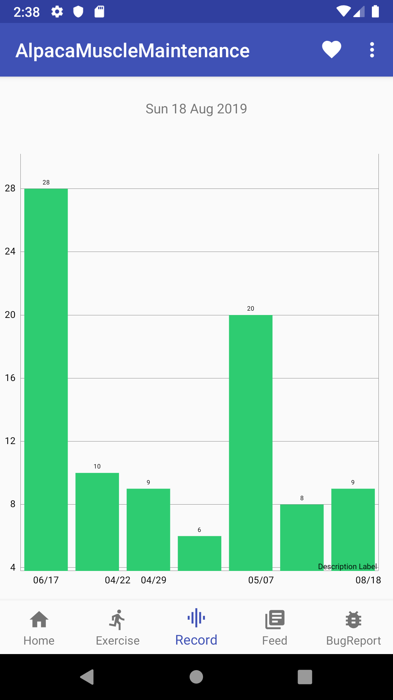

# Alpaca Muscle Maintenance

## Overview

An Android app using Kotlin which enables you to record the numbers of push-up (will also support squat someday).
This shows posts calling [Qiita API](https://qiita.com/api/v2/docs). It's a website basically people post technical articles, but there is `筋トレ` (muscle maintenance) tag for some reasons.

For entire design, this app tries to follow clean architecture, and for technology stack it uses:
- [Data Binding Library](https://developer.android.com/topic/libraries/data-binding)
- [Navigation component](https://developer.android.com/guide/navigation)
- [LiveData](https://developer.android.com/topic/libraries/architecture/livedata)
- [Kotlin coroutines](https://developer.android.com/kotlin/coroutines)
- [Hilt](https://developer.android.com/training/dependency-injection/hilt-android)

## Views

### Home

It shows wisdom words to encourage you to do exercise. It shows several words randomly and appears slowly using [AnimationUtils.loadAnimation](https://developer.android.com/reference/android/view/animation/AnimationUtils.html#loadAnimation(android.content.Context,%20int)).

### Exercise

You can record the number of push-ups. The idea is that... you push the gray big button with your chin 😂 When you push `+` button at bottom right, it saves record data using [Room Persistence Library](https://developer.android.com/topic/libraries/architecture/room). Squat tab will come someday (how can I record it?)

### Record

It shows the number of push-ups in time series. Uses [MPAndroidChart](https://github.com/PhilJay/MPAndroidChart) to make the graph.

### Feed

It shows posts which are related to muscle maintenance. Uses [Retrofit](https://github.com/square/retrofit) to access Web API and [Glide](https://github.com/bumptech/glide) to load images as thumbnails.
When we tap a rows, it opens the page in WebView.

### Repository page

Shows this Github repository to see any updates.

## Author

Masataka Hirano - [alpaca0984](https://github.com/alpaca0984)
